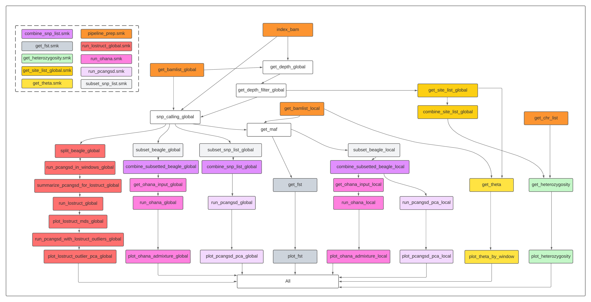

```{r setup, include=FALSE}
knitr::opts_chunk$set(echo = TRUE)
```

**loco-pipe** is an automated Snakemake pipeline that streamlines a set of essential population genomic analyses for **lo**w-**co**verage whole genome sequencing (lcWGS) data.

## Key features

* Streamlining of several essential population genomic analyses
* Can be launched with a single line of code
* Incorporation of key filtering steps and best practices for low-coverage data
* Key results are plotted automatically for visual inspection
* Easy customization through a configuration file
* Detailed tutorial with a [toy dataset](https://github.com/sudmantlab/loco-pipe/blob/main/toyfish.md) and extensive in-line annotation
* Flexible architecture that allows for the addition of new features
* Inheritance of the many benefits offered by Snakemake, including
    * High computational efficiency achieved through massive parallelization 
    * Seamless integration with common job schedulers on computer clusters
    * The ability to automatically continue from the last failed or interrupted job
    * Built-in software management system and robust file structure

## Currently supported functionalities

* Depth counting
* SNP calling
* Allele frequency estimation
* Site frequency spectrum (SFS) estimation
* Fixation index (Fst) estimation
* Principal component analysis (PCA)
* Admixture analysis
* Theta estimation
* Neutrality test statistics
* Heterozygosity estimation
* Local PCA analysis

## Pipeline flowchart



## Before you start

#### Reference genome

This pipeline requires a moderately contiguous reference genome for your study system. Currently, it does not support highly fragmented reference genomes, since most analyses are parallelized by scaffolds. Having too many scaffolds or unscaffolded contigs will create too many parallel jobs for Snakemake and a job scheduler to handle. We recommend that 90% of the genome should be consisted of no more than 100 scaffolds (i.e. L90 < 100). Small scaffolds and contigs should be excluded from the analysis (we will ask you to provide a list of scaffolds that you would like to include).

#### Sequence alignment files

In addition, we assume that properly mapped and filtered bam files are ready to be used as input files for loco-pipe. You can choose your favorite software and/or pipeline to go from fastq to bam, but one pipeline that we particularly recommend is [grenepipe](https://github.com/moiexpositoalonsolab/grenepipe). 

#### grenepipe

grenepipe is a Snakemake pipeline for variant calling from raw sequence data. Although it is developed for high-coverage data, you can skip the variant calling step by using the `all_qc` [shortcut](https://github.com/moiexpositoalonsolab/grenepipe/wiki/Advanced-Usage#running-only-parts-of-the-pipeline) and turning the `bcftools-stats` switch in the config file to `false`. This way, grenepipe will stop after generating the final bam files and their associated quality reports. (We also recommend turning the `clip-read-overlaps` switch to `true` and setting `VALIDATION_STRINGENCY=SILENT` for `picard MarkDuplicates` in the configuration file.) grenepipe is very thoughtfully built and [extensively documented](https://github.com/moiexpositoalonsolab/grenepipe/wiki), and it is a major inspiration for loco-pipe. Familiarizing yourself with grenepipe will also make loco-pipe much easier to learn.

#### Toy dataset

If you don't yet have your data ready for loco-pipe, and even if you do, we highly recommend you to first test loco-pipe with a heavily subsetted toy dataset that we provide: [toyfish](https://github.com/sudmantlab/loco-pipe/blob/main/toyfish.md). It only takes loco-pipe a few minutes to analyse the toy dataset on a computer cluster, making it much easier to learn and troubleshoot.

## Setting up the pipeline

1. Install [mamba](https://mamba.readthedocs.io/en/latest/installation/mamba-installation.html) or conda (https://docs.conda.io/projects/conda/en/stable/user-guide/install/index.html) if you have not already done so. A fresh install of mamba with miniforge (https://github.com/conda-forge/miniforge) is highly recommended because mamba is much faster than conda. It is ok if you prefer to use conda though; just replace all occurrences of `mamba` with `conda` in the code below.

2. Download `loco-pipe` from GitHub (e.g. using `git clone`). We recommend you to download it to a folder where you store your software programs. We will refer to the full path of the directory that contains the `loco-pipe` folder as `SOFTWARE_DIR`.

3. Create the `loco-pipe` conda environment using mamba by running `mamba env create -f $SOFTWARE_DIR/loco-pipe/workflow/envs/loco-pipe.yaml` (replace $SOFTWARE_DIR with a real path).

4. (Optional) If you would like to run PCA with the software [PCAngsd](https://github.com/Rosemeis/pcangsd) using loco-pipe, you **must** install PCAngsd manually as it is not yet available on conda. Please install it to a conda environment named `pcangsd_lcpipe` using the script below. Even if you already have PCAngsd installed on your machine, you will need to run the following code to ensure that the version is compatible.

    ```{bash eval=FALSE}
    # first set your working directory to a folder where you store your software programs
    cd $SOFTWARE_DIR # replace $SOFTWARE_DIR with a real path
    # download PCAngsd from Github
    git clone https://github.com/Rosemeis/pcangsd.git
    cd pcangsd
    # check out the version the loco-pipe is based on
    git checkout 2880c6aafe5c8b075f7730779cc6f94fee2c9bbb
    # create an environment for PCAngsd 
    mamba env create -f $SOFTWARE_DIR/loco-pipe/workflow/envs/pcangsd.yaml
    # activate the conda environment
    conda activate pcangsd_lcpipe
    # build PCAngsd
    python setup.py build_ext --inplace  
    pip3 install -e .
    # deactivate the conda environment
    conda deactivate  
    ```

5. (Optional) If you would like to run local PCA with the [lostruct](https://github.com/petrelharp/local_pca) package in R using loco-pipe, you **must** install lostruct (in addition to PCAngsd, see above) manually as it is not yet available on conda. Please install it to a conda environment named `lostruct_lcpipe` using the script below.

    ```{bash eval=FALSE}
    # create a conda environment named lostruct_lcpipe and install R and some key R packages
    mamba env create -f $SOFTWARE_DIR/loco-pipe/workflow/envs/lostruct.yaml
    # activate the lostruct conda environment
    conda activate lostruct_lcpipe
    # launch R
    R
    # install lostruct
    devtools::install_github("petrelharp/local_pca/lostruct")
    # quit R
    q()
    # deactivate the conda environment
    conda deactivate  
    ```

    Note: depending on your system, you may need to ensure that lostruct is properly installed to the `lostruct_lcpipe` environment with something like the following 
    
    ```{r eval=FALSE}
    withr::with_libpaths(new = "/path/to/conda/envs/lostruct_lcpipe/lib/R/library",
                         devtools::install_github("petrelharp/local_pca/lostruct"))
    ```

## Preparing the project directory and required input files

1. Set up the file structure. 

    * First, create a base directory for your project. This folder should be separate from the `loco-pipe` folder. You can name it however you want (just avoid special characters other than dashes and underscores), but we will refer to the full path of this folder as `BASEDIR`.
    
    * Within `BASEDIR`, create two new folders: `docs`, and `config`. 
    
    * You can also have your sequencing data (e.g. fastq and bam files) and the reference genome in separate folders in `BASEDIR`, but this is not required.

2. Prepare a **sample table** and a **chromosome table**. Both of these should be tab separated text files. Store them in the `docs` folder in `BASEDIR`. You can name them however you want.

    * Sample table: This table should contain a minimum of three columns in no particularly order. One column should be named exactly as `sample_name` and it should contain sample IDs of all the samples to be included in the analysis. Another column should be named exactly as `bam` and it should store the full paths of the bam file for each sample. A third column should specify the grouping information you wish to segregate the samples by. These could be species, subspecies, ecotypes, populations, sampling sites, sex, etc. You will need to enter the name of the third column into the pipeline configuration file `config.yaml`. Below is an example of a sample table.
    
        ```{r echo=FALSE, message=FALSE}
        library(tidyverse)
        read_tsv("toyfish/docs/sample_table.tsv") %>% group_by(population) %>% slice_head(n=2) %>% knitr::kable()
        ```
        
        > A few tips about the sample table:
            * Sample names have to be unique, and each sample should correspond to a single bam file (i.e. we assume that if you have multiple bam files for a single sample, they have already been merged). In cases where you would like to keep different bam files from the same sample separate, e.g. for batch effect control, you will need to distinguish them by assigning them different sample names, e.g. by adding a suffix to their original names. If you do this, please also note that including multiple copies of the same sample can severely bias certain analyses, such as PCA, so we recommend you to only do this in the first iteration of the pipeline, and once the risk of batch effect is eliminated, you should merge or remove the duplicated samples.
            * You can have multiple grouping variables in the sample table, although you may need to launch the pipeline more than once in order to conduct analyses based on different grouping variables.
            * In practice, you may need to have multiple versions of the sample table. For example, you may include all samples in the first run, exclude some problematic one and/or change the grouping of others based on the result of the first run, and launch the pipeline again with an updated sample table. 
            * In case that you don't have any grouping information a priori, you still need to have a fake grouping column with all samples having the same entry for plotting purposes (e.g. PCA and admixture). In this case, you will also need to turn off all population-level analyses in the configuration file (see below).
        
    * Chromosome table: This table should contain one or two **unnamed** columns. The first column is required, and it records the names of all chromosomes/scaffolds/contigs that you would like to include in the analysis. These should exactly match the names in the reference genome. The second column is optional, and it records shortened or alternative names of the chromosomes/scaffolds/contigs which you would like to show on the plots. If the second column is empty, the original names will be shown. Below is an example of a chromosome table.
    
        ```{r echo=FALSE, message=FALSE}
        library(tidyverse)
        read_tsv("toyfish/docs/chr_table.tsv", col_name=FALSE) %>% knitr::kable(col.names = NULL)
        ```
        
        > A few tips about the sample table:
            * As mentioned earlier, we recommend against including too many chromosomes/scaffolds/contigs in the chromosome table (e.g. < 100). 
            * If you would like to use the plotting modules in loco-pipe to generate Manhattan-like plots automatically, we would also recommend to only include reference sequences of similar sizes (e.g. you shouldn't include unincorporated contigs in the chromosome table when you have a chromosomal level assembly). 

3. Edit the configuration files.

    * The pipeline config file `config.yaml`: This config file serves as an easily accessible way to control the behavior of loco-pipe. You can use it to 1) specify the location of input files, 2) include or exclude certain analyses from a loco-pipe run, 3) adjust the parameter settings for different analyses. This config file is thoroughly annotated, so please read it through and make edits when needed. **Importantly**, please copy `config.yaml` to the `config` folder in your project directory (i.e. `cp $SOFTWARE_DIR/loco-pipe/config.yaml $BASEDIR/config/config.yaml`) and make your edits there rather in the `loco-pipe` directory. 
    
    * (Optional) The cluster config file `cluster_config.yaml` under `workflow/profiles`: This config files specifies the resources each step of the pipeline can use on a computer cluster. We have extensively tested loco-pipe with a slurm job scheduler and an example slurm profile is included in loco-pipe (`workflow/profiles/slurm`), but other job schedulers should also work with Snakemake given an appropriate profile setup (see [Snakemake manual](https://snakemake.readthedocs.io/en/stable/executing/cli.html#profiles) for details).

## Launching the pipeline

1. Activate the `loco-pipe` environment with `conda activate loco-pipe`.

2. You are now ready to launch the pipeline. We recommend to always start with a dry run using the `-n` flag before actually running it.

    ```{bash eval=FALSE}
    snakemake \
    --use-conda \
    --conda-frontend mamba \
    --directory $BASEDIR \
    --rerun-triggers mtime \
    --scheduler greedy \
    --snakefile $SOFTWARE_DIR/loco-pipe/workflow/pipelines/loco-pipe.smk
    ```
    
    When running loco-pipe on a computer cluster, make sure to use the `--profile` flag to specify your cluster profile. Other flags that may be useful are `--conda-prefix`, `--default-resources`, `--printshellcmds`, `--cores`, etc.

## Future directions

We plan to improve the functionality of loco-pipe, by incorporating additional analyses (e.g. GWAS, dxy, LD estimation and pruning) into this pipeline and also enabling more functionalities for the existing software programs (e.g. ANGSD, Ohana). In terms of variety, we also hope to provide more software options for users to pick for certain analysis (e.g. winSFS for SFS estimation, ngsAdmix for admixture analysis).

All kinds of feedback, such as bug reports and feature requests, are welcome on the "Issue" page. We also encourage users to build on the existing infrastructure and add more functionalities to loco-pipe in the form of pull requests.
