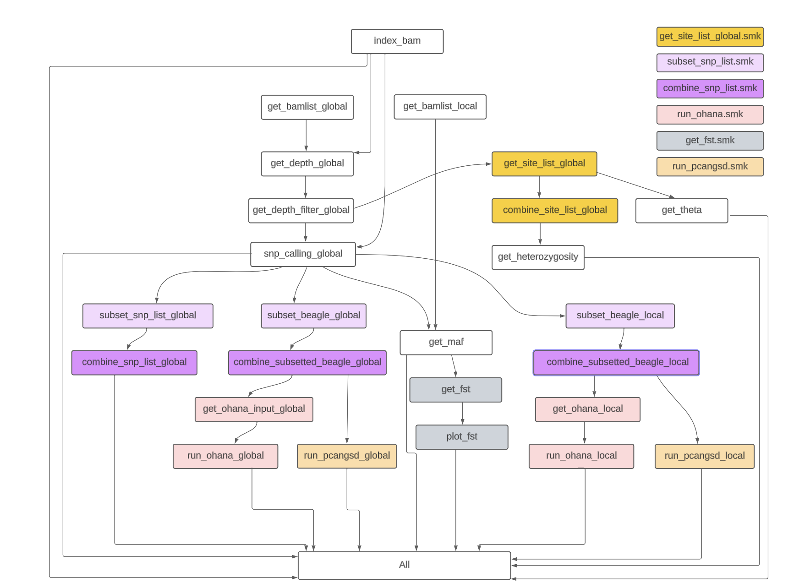

loco-pipe: a Snakemake pipeline for low-coverage whole-genome sequencing
================

- <a href="#key-features" id="toc-key-features">Key features</a>
- <a href="#currently-supported-functionalities"
  id="toc-currently-supported-functionalities">Currently supported
  functionalities</a>
- <a href="#pipeline-flowchart" id="toc-pipeline-flowchart">Pipeline
  flowchart</a>
- <a href="#before-you-start" id="toc-before-you-start">Before you
  start</a>
- <a href="#setting-up-the-pipeline"
  id="toc-setting-up-the-pipeline">Setting up the pipeline</a>
- <a href="#preparing-the-project-directory-and-required-input-files"
  id="toc-preparing-the-project-directory-and-required-input-files">Preparing
  the project directory and required input files</a>
- <a href="#launching-the-pipeline"
  id="toc-launching-the-pipeline">Launching the pipeline</a>
- <a href="#future-directions" id="toc-future-directions">Future
  directions</a>

**loco-pipe** is an automated Snakemake pipeline that streamlines a set
of essential population genomic analyses for low-coverage whole genome
sequencing (lcWGS) data.

## Key features

- Streamlining of several essential population genomic analyses
- Can be launched with a single line of code
- Incorporation of key filtering steps and best practices for
  low-coverage data
- Easy customization through a configuration file
- Detailed tutorial with an example dataset and extensive in-line
  annotation
- Flexible architecture that allows for the addition of new features
- Inheritance of the many benefits offered by Snakemake, including
  - High computational efficiency achieved through massive
    parallelization
  - Seamless integration with common job schedulers on computer clusters
  - The ability to automatically continue from the last failed or
    interrupted job
  - Built-in software management system and robust file structure

## Currently supported functionalities

- Depth counting
- SNP calling
- Allele frequency estimation
- Site frequency spectrum (SFS)
- Fixation index (Fst) estimation
- Principal component analysis (PCA)
- Admixture analysis
- Theta estimation
- Neutrality test statistics
- Heterozygosity estimation
- Local PCA analysis

## Pipeline flowchart



## Before you start

#### Reference genome

This pipeline requires a moderately contiguous reference genome for your
study system. Currently, it does not support highly fragmented reference
genomes, since most analyses are parallelized by scaffolds. Having too
many scaffolds or unscaffolded contigs will create too many parallel
jobs for Snakemake and a job scheduler to handle. We recommend that 90%
of the genome should be consisted of no more than 100 scaffolds
(i.e. L90 \< 100). Small scaffolds and contigs should be excluded from
the analysis (we will ask you to provide a list of scaffolds that you
would like to include).

#### Sequence alignment files

In addition, we assume that properly mapped and filtered bam files are
ready to be used as input files for loco-pipe. You can choose your
favorite software and/or pipeline to go from fastq to bam, but one
pipeline that we particularly recommend is
[grenepipe](https://github.com/moiexpositoalonsolab/grenepipe).

#### grenepipe

grenepipe is a Snakemake pipeline for variant calling from raw sequence
data. Although it is developed for high-coverage data, you can skip the
variant calling step by using the `all_qc`
[shortcut](https://github.com/moiexpositoalonsolab/grenepipe/wiki/Advanced-Usage#running-only-parts-of-the-pipeline)
and turning the `bcftools-stats` switch in the config file to `false`.
This way, grenepipe will stop after generating the final bam files and
their associated quality reports. (We also recommend turning the
`clip-read-overlaps` switch to `true` and setting
`VALIDATION_STRINGENCY=SILENT` for picard MarkDuplicates in the config
file.) grenepipe is very thoughtfully built and [extensively
documented](https://github.com/moiexpositoalonsolab/grenepipe/wiki), and
it is the main inspiration for loco-pipe. Familiarizing yourself with
grenepipe will also make loco-pipe much easier to learn.

If you choose to use grenepipe to generate your bam files. Here are our
recommendations on making the transition from grenepipe to loco-pipe as
seamless as possible.

> - `all_qc` flag and `bcftools-stats: false`
> - `clip-read-overlaps: true` and `VALIDATION_STRINGENCY=SILENT` for
>   `picard MarkDuplicates`

## Setting up the pipeline

1.  Install
    [mamba](https://mamba.readthedocs.io/en/latest/mamba-installation.html#mamba-install)
    if you have not yet done so. A fresh install with Mambaforge is
    highly recommended.

2.  Download `loco-pipe` from GitHub (e.g. using `git clone`). We
    recommend you to download it to a folder where you store your
    software programs. We will refer to the full path of the resulting
    `loco-pipe` folder as `PIPEDIR`.

3.  Create the `loco-pipe` conda environment using mamba by running
    `mamba env create -f $PIPEDIR/workflow/envs/loco-pipe.yaml` (replace
    \$PIPEDIR with a real path).

4.  (Optional) If you would like to run PCA with the software
    [PCAngsd](https://github.com/Rosemeis/pcangsd) using loco-pipe, you
    **must** install PCAngsd manually as it is not yet available on
    conda. Please install it to a conda environment named `pcangsd`
    using the script below.

    ``` bash
    # first set your working directory to a folder where you store your software programs
    cd $SOFTWARE_DIR # replace $SOFTWARE_DIR with a real path
    # download PCAngsd from Github
    git clone https://github.com/Rosemeis/pcangsd.git
    cd pcangsd
    # check out the version the loco-pipe is based on
    git checkout 2880c6aafe5c8b075f7730779cc6f94fee2c9bbb
    # create an environment for PCAngsd 
    mamba env create -f environment.yml  
    # activate the conda environment
    conda activate pcangsd
    # build PCAngsd
    python setup.py build_ext --inplace  
    pip3 install -e
    # deactivate the conda environment
    conda deactivate  
    ```

5.  (Optional) If you would like to run local PCA with the
    [lostruct](https://github.com/petrelharp/local_pca) package in R
    using loco-pipe, you **must** install lostruct (in addition to
    PCAngsd, see above) manually as it is not yet available on conda.
    Please install it to a conda environment named `lostruct` using the
    script below.

    ``` bash
    mamba create -n lostruct -c conda-forge r-essentials=4.2 r-tidyverse=2.0.0 r-devtools=2.4.5 r-cowplot=1.1.1
    conda activate -n lostruct
    ## this is an awkward solution, but I had to do it because lostruct would be installed to my system library location rather than the conda environment specific one instead
    devtools::install_github("petrelharp/local_pca/lostruct")
    ```

## Preparing the project directory and required input files

1.  Set up the file structure.
    - First, create a base directory for your project. This folder
      should be separate from the loco-pipe folder. You can name it
      however you want (just avoid special characters other than dashes
      and underscores), but we will refer to the full path of this
      folder as `BASEDIR`.
    - Within `BASEDIR`, create a new folder called `docs`. You can also
      have your sequencing data (e.g. fastq and bam files) in separate
      folders in `BASEDIR`, but this is not required.
2.  Prepare a **sample table** and a **chromosome table**. Both of them
    should be tab separated. Store them in the `docs` folder in
    `BASEDIR`. You can name them however you want.
    - Sample table: This table should contain a minimum of three columns
      in no particularly order. One column should be named exactly as
      `sample_name` and it should contain sample IDs of all the samples
      to be included in the analysis. Another column should be named
      exactly as `bam` and it should store the full paths of the bam
      file for each sample. A third column should specify the grouping
      information you wish to segregate the samples by These could be
      sampling sites, populations, ecotypes, sex, subspecies, species,
      etc. You will enter the name of the third column into the pipeline
      configuration file (see below).

      > A few tips about the sample table:
      > - Sample names have to be unique, and each sample should
      >   correspond to a single bam file (i.e. we assume that if you
      >   have multiple bam files for a single sample, they have already
      >   been merged). In cases where you would like to keep different
      >   bam files from the same sample separate, e.g. for batch effect
      >   control, you will need to distinguish them by assigning them
      >   different sample names, e.g. by adding a suffix to their
      >   original names. If you do this, please also note that
      >   including multiple copies of the same sample can severely bias
      >   certain analyses, such as PCA, so we recommend you to only do
      >   this in the first iteration of the pipeline, and once the risk
      >   of batch effect is eliminated, you should merge or remove the
      >   duplicated samples.
      > - You can have multiple grouping variables
      > - You can run part of the pipeline first and then assign the
      >   grouping variable
      > - In general, you can have several iterations of the sample
      >   table

    - Chromosome table: This table should contain one or two columns.
      The first column is required, and it records the names of all
      chromosomes/scaffolds/contigs that you would like to include in
      the analysis. As mentioned earlier, we recommend against including
      too many of them (e.g. \< 100). These should exactly match the
      names in the reference genome. The second column is optional, and
      it records shortened or alternative names of the
      chromosomes/scaffolds/contigs which you would like to show on the
      plots. If the second column is empty, the original names will be
      shown.
3.  Edit the configuration files
    - The pipeline config file `loco-pipe.yaml`: This config file stores
      information that could be read by the loco-pipe. You should change
      the elements under the “global” tab based on your own research
      data and modify the hyper-parameters below other tabs depending on
      your preference. This file is also designed to allow you control
      what features you want to include in your own runs. For example,
      if you wish not to have calculate Fst, you can edit the ‘get_Fst:
      true’ to ‘get_Fst: true’, and the “get_Fst” switch will be turned
      off. The config file is thoroughly annotated, so please read it
      through and make edits when needed.
    - The cluster config file
      `workflow/profiles/slurm/cluster_config.yaml` (Optional): This
      config files specifies the resources each step of the pipeline can
      use on a computer cluster.

## Launching the pipeline

1.  Activate the `loco-pipe` environment with
    `conda activate loco-pipe`.

2.  You are now ready to launch the pipeline. We recommend to always
    start with a dry run using the `-n` flag before actually running it.

    ``` bash
    snakemake \
    --use-conda \
    --conda-frontend mamba \
    --directory $BASEDIR \
    --scheduler greedy \
    --rerun-triggers mtime \
    --snakefile $PIPEDIR/workflow/pipelines/loco-pipe.smk 
    ```

    When running it on a computer cluster, make sure to use the
    `--profile` flag to specify your cluster profile. Other flags that
    may be useful are `--conda-prefix`, `--default-resources`, `-p`,
    etc.

## Future directions

We plan to improve the functionality of loco-pipe, by incorporating more
analyses (e.g. GWAS, dxy) into this pipeline and also enabling more
functionalities for the existing softwares (e.g. ANGSD, Ohana). In terms
of variety, we will also provide more software options for users to pick
for certain analysis (e.g. winSFS, ngsAdmix).
