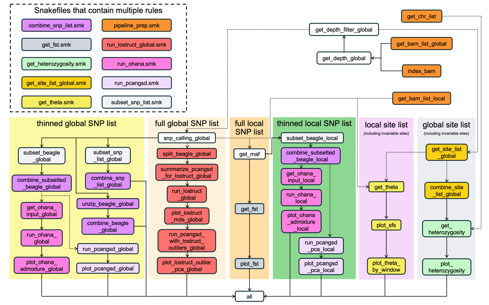

```{r setup, include=FALSE}
knitr::opts_chunk$set(echo = TRUE)
```

## Complete pipeline flowchart 


Each box represents a Snakemake rule and is colored based on the major groups of analyses in the form of separate Snakefiles (shown at the top left corner). The differently colored shades indicate the types of SNPs or sites on which the analyses are conducted. Dashed arrows indicate key modules that can be turned on or off in the configuration file. The four orange boxes at the top right corner (part of the “pipeline_prep.smk” Snakefile) are the starting points of the pipeline, and the “all” box at the bottom is the end point. Please see the section below for detailed descriptions of each Snakemake rule.

## Detailed description of the analytical steps 

[Pipeline preparation and depth filter determination](pipeline_prep.md)

[Analyses using the full global SNP list](full_global_snp.md)

[Analyses using the full local SNP lists](full_local_snp.md)

[Analyses using the thinned SNP lists (global or local)](thinned_snp.md)

[Analyses using the full global site lists (global or local)](full_site.md)

## Directory structure

* `loco-pipe/workflow`: Snakemake pipeline
  * `pipelines/loco-pipe.smk`: main Snakefile
  * `rules/`: Snakefiles of individual modules
  * `scripts/`: various scripts (now mainly in R) that some of the Snakefiles use
  * `envs/`: conda environment files
  * `profiles`: cluster profiles

* `loco-pipe/toyfish/`: test dataset
  * `bams/`: sequence alignment files in bam format
  * `reference`: reference genome in fasta format
  * `docs/`: input text files
  * `figures/`: output figures

* `loco-pipe/manual/`: user's manual

* `loco-pipe/config.yaml`: pipeline configuration file

## Tips and suggestions

#### Never use loco-pipe a black box

loco-pipe is not intended to be used as a black box where users can simply input the data and expect flawless results without knowing what happens in between. We try our best to help you navigate through the complex workflow as painless as possible and avoid some of the common pitfalls, but it is not possible to account for every peculiarity in any given dataset. Therefore, it is critical for users to develop a good understanding of the structure and mechanism of loco-pipe, the software it uses, and lcWGS data analysis in general to ensure the proper use of the pipeline. For example, the configuration file needs to be carefully read through and edited, various intermediate outputs need to be sanity checked, and all results need to be interpreted with caution. To facilitate this process, we strive to provide ample resources in this GitHub repo, but please let us know in the [Issues page](https://github.com/sudmantlab/loco-pipe/issues) when we fall short (and we inevitably will). We will try our best to reply in a timely fashion. 

In addition to this GitHub repo, you may find the following resources helpful when working with loco-pipe.

* [A beginner's guide to lcWGS](https://doi.org/10.1111/mec.16077)
* [The ANGSD website](https://www.popgen.dk/angsd/index.php/ANGSD)
* [The PCAngsd website](https://www.popgen.dk/software/index.php/PCAngsd)
* [The Ohana website](https://github.com/jade-cheng/ohana)
* [The Snakemake manual](https://snakemake.readthedocs.io/en/stable/)
* [The grenepipe website](https://github.com/moiexpositoalonsolab/grenepipe)

#### Input sequence alignment files

It is important to check the evenness of sequencing depth of the input BAM files and the evenness of sample size across populations before launching the pipeline. Samples with extremely low sequencing depth compared to others (e.g. <0.5x), as well as populations with extremely low sample sizes (e.g. n<5), may need to be excluded from certain analyses. Also be aware that large variance in sequencing depth can lead to batch effects for certain analyses (e.g. one of the PC axes correlates with depth), and uneven sample sizes across populations can also lead to technical artifacts (e.g. admixture analysis over-splitting populations with large sample sizes). It doesn't necessarily mean that downsampling or additional sequencing efforts are required; users just need to bare these in mind when interpreting the results.

#### Depth filtering

We highly recommend users to check the depth distribution plot before going further in the pipeline. They should expect to see the bulk of the distribution falling inside the minimum and maximum depth filters, with both tails excluded. If they find the filters to be too relaxed or too stringent, they should adjust the n_sd parameter in the config file accordingly. If the fitted normal distribution is a poor fit to the data, they should manually set depth filters in the “depth_filter.tsv” file. 

#### Global SNP calling

Users can use the `extra` flag in the configuration file to add in more flags for additional filtering and analyses. For example, they can use the “-sites” flag to constrain SNP calling on a prefiltered SNP list, so that the corresponding genotype likelihood files can be generated and the downstream analyses can be carried on accordingly. See the “Advanced usages of loco-pipe” section below for detailed instructions. 

#### Sample mislabeling

Mislabeled samples can lead to inaccurate estimations of allele frequencies and diversity stats. Therefore, users should inspect the PCA results and correct for any mislabeled samples before continuing the pipeline. 

#### Important assumptions of the software

All software used in the pipeline make various assumptions about the data. The violation of some of these can be have particularly strong impacts on the result. It is therefore important for the user to understand the the inner mechanisms of these software. Below are a few examples of these:

* Independence among SNPs: PCA and admixture analysis assume a set of unlinked SNPs. Our SNP thinning procedure can help ensure this in many scenarios, but not when there is a large non-recombining block in the genome (e.g. a chromosome inversion). In such cases, the non-recombining block may drive the patterns in the PCA and admixture analysis. This doesn't render their result invalid, but you may want to provide a list of SNPs excluding the non-recombining region (see above) to get a more accurate account of the underlying population structure in such cases. 

* Empirical Bayes inference and the importance of the prior: Some analytical steps in ANGSD uses the empircal Bayes inference approach, where a prior is derived from the data itself for the estimation of the posterior. In such cases, a mis-specification of the prior can severely bias the results. Analyses that can be affected by this are the estimation of diversity stats and Fst, both of which use the SFS (1dSFS including invariable sites for the former, 2dSFS excluding invariable sites for the latter) as their prior. Therefore, it is important to sanity check these SFS and make sure that their take reasonable shapes. (Note that the 1dSFS is plotted by default, but users may need to manually check the 2dSFS).


#### CPU and memory requirements

In our experience, the most CPUs that the main ANGSD software (excluding standalone modules such as realSFS) can take advantage of is 8, which is why we hard-coded most of these analyses to 8 threads. This setting should be considered a higher bound though, since users can ask for fewer CPUs than 8 by either editing their cluster configuration file if they run loco-pipe on a computer cluster, or with snakemake commands if they run on an individual machine. In other cases where the software can take advantage of more CPUs, we include the number of CPUs as a parameter that they can adjust in the configuration file. As for memory requirements, in many cluster systems, RAM is automatically allocated based on the number of CPUs requested. In such cases, we recommend users to start with a certain number of CPUs (explained in the config file), and increase that number if they encounter memory problems. In cases where the users have to specify the amount of memory to request, we recommend them to input these with either the cluster configuration file or snakemake commands.

#### Advanced usage of loco-pipe

Although we anticipate that the current setup of loco-pipe is sufficient for most use cases, there could be other scenarios where more customization is warranted. In such cases, users may need to manually edit some of the Snakefiles, or to run some analyses manually before relaunching the pipeline. Because of the flexibility that Snakemake provides and the modular nature of loco-pipe, these advanced use cases are often fairly straightforward to implement. We provide some examples below for inspiration.

###### Advanced filtering procedures

The current version of loco-pipe allows users to apply simple depth and missingness filters, but some users might find it useful to apply additional filters, e.g. to ensure the evenness of coverage across populations, or to remove problematic SNP calls caused by paralogous sequences or misalignment (see [Dallaire et al. 2024](https://academic.oup.com/gbe/article/15/12/evad229/7470724) for details). Ultimately, the optimal filtering approaches vary from project to project, so we decided to not directly implement any specific advanced filtering methods in the current version of loco-pipe. However, we note that it is relatively straightforward to manually incorporate these filters to loco-pipe thanks to its modular nature. The key idea is to run part of the pipeline with the default filters, perform some advanced filtering procedures manually, and rerun part of the pipeline with the updated SNP/site list. We provide instructions on two of these filtering procedures below.


* "Deviant" SNP filter: As described in [Dallaire et al. 2024](https://academic.oup.com/gbe/article/15/12/evad229/7470724), deviant SNPs refers to those SNPs that do not conform to expected patterns of heterozygosity and allelic ratio for nonduplicated loci. In the paper, the authors recommended a workflow to filter out these deviant SNPs. To implement this method with loco-pipe, users can first run the pipeline until the `snp_calling_global` step (this can be done by only turning the `snp_calling_global` switch on in the config file to “TRUE” and other switches to “FALSE”). With output from `snp_calling_global`, users will be able to follow the recommended workflow to identify the deviant SNPs. Next, they could generate a new SNP list excluding the deviant SNPs in ANGSD format and index it with ANGSD. They can then use the `-site` flag to restrict another round of SNP calling on this new SNP list (this can be done with the `extra` flag in the config file or by directly editing the `snp_calling_global` rule), rename the existing `angsd/snp_calling_global` directory to something else, and relaunch the pipeline. This way, the pipeline will perform SNP calling again, but this time only at sites included in the updated SNP list, and generate output files (e.g. genotype likelihoods) that do not include any deviant SNPs that can be used for downstream analyses.

* Evenness of coverage across samples and populations: In general, users should be aware of potential issues associated with uneven read depth across samples, and uneven sample sizes across different populations. Results from samples with very low read depth or populations with low sample sizes should be interpreted with caution. Therefore, we recommend users to always check the depth distribution and missingness in each sample and each population, which are outputted from the `snp_calling_global`, `get_maf`, and `get_theta` rules. Oftentimes, it may be warranted to run part of the pipeline with all samples included, summarize their read depth and missingness, exclude individuals or populations with extremely low sample size / read depth from the metadata table, and relaunch the pipeline. Additionally, it can sometimes be helpful to narrow down the global SNP list based to ensure even coverage across populations. To achieve this, users can run the pipeline until `get_maf` and `get_theta`, and manually generate a SNP/site list by intersecting the SNPs that pass a certain population-level missingness threshold. Similar to the previous example, they can then index this SNP/site list, input it to `snp_calling_global` and `get_theta` with the `-site` flag, rename the existing `snp_calling_global` and `get_theta` folders, and relaunch the pipeline. 

###### Tweaking what analyses to run

As mentioned above, loco-pipe is highly modular and users can choose which analyses to run or skip in the config file. In addition, within each analysis, users can also decide to only run part of it, although this requires a bit of editing in the Snakefile. An example of this is Fst estimation. The default behavior of loco-pipe is to estimate Fst in all pairs of populations specified in the metadata table. However, this may become cumbersome when there are a lot of populations and only certain comparisons are of interest. In such cases, users can edit the `POP_L1_FST_PATH` and `POP_L1_FST_PLOT_PATH` variables in `workflow/pipelines/loco-pipe.smk`. The following lines require loco-pipe to estimate Fst and plot the results in all population pairs.

```{python eval=FALSE, python.reticulate = FALSE}
POP_L1_FST_PLOT_PATH = []
POP_L1_FST_PATH = []
for i in range(len(POP_L1)):
  for j in range(i+1, len(POP_L1)):
    POP_L1_FST_PLOT_PATH.append(config["global"]["basedir"] + '/figures/fst/' + POP_L1[i] + '.' + POP_L1[j])
    POP_L1_FST_PATH.append(config["global"]["basedir"] + '/angsd/get_fst/' + POP_L1[i] + '.' + POP_L1[j])
```

To run these analyses on selected pairs of populations, users can simply redefine the `POP_L1_FST_PATH` and `POP_L1_FST_PATH` with only the pairs of populations they are interested in

