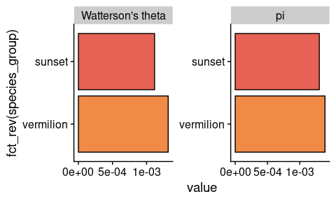
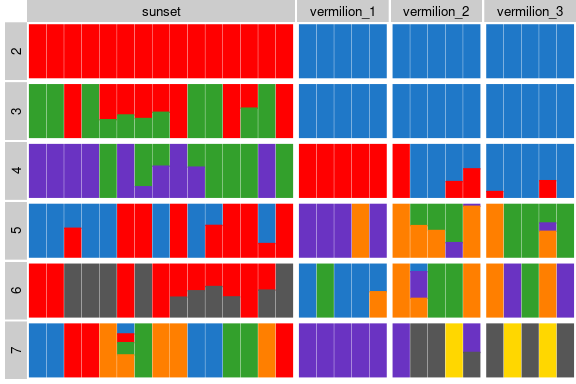
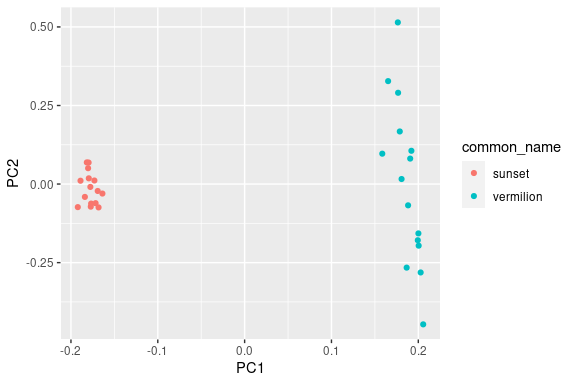

Toyfish - a trimmed dataset from real rockfish data
================

In the Toyfish dataset, we have a total of 30 rockfish from two
populations: sunset and vermilion; each population has 15 specimens.
Within vermilion population, there are three sub-populations that are
named creatively as: vermilion_1, vermilion_2 and vermilion_3; each
sub-population has 5 specimens.

Fun fact: rockfishes have 25 chromosomes; however, with the aim of
having a time-saving test dataset, I selected 3 million base pairs from
chr15 and chr16 (from 17Mbp to 20Mbp) and furthur subset 40% of them.
These bam files are stored inside a folder called “bams”. The reference
file is zipped and stored inside the “toyfish” folder; remember to unzip
it before running the pipeline!

Here are the codes you need to run loco-pipe and

#### To run the pipeline

``` bash
## First, move to the folder that includes the exploratory_analyses.smk.
cd /global/scratch/users/zzhou32/rockfish_popgen/workflow/pipelines

## Then, activate the Loco-pipe environment
conda activate locopipe

## Finally, adjust the flags below as needed and run the pipeline! 
## The ending -n flag means it is a dry run. If the dry run goes through, remove "-n" and rerun the pipe-line.
snakemake \
  --conda-frontend mamba \
  --conda-prefix /global/scratch/users/zzhou32/mambaforge/envs \
  --directory /global/scratch/users/zzhou32/loco-pipe/toyfish \
  --profile /global/scratch/users/nicolas931010/rockfish_popgen/workflow/profiles/slurm_savio3_htc \
  --scheduler greedy \
  --default-resources mem_mb=None disk_mb=None \
  --rerun-triggers mtime \
  --snakefile exploratory_analyses.smk -n
  
```

#### To visualize your results.

We provide template codes to make three different visualizations: theta
plots, population admixture, and pca plots of all specimens. As
automatic and convenient as the template could be, you still need to
change some elements manually (e.g. meta_data table pathway, base
direction, etc.) 1. Theta plots

``` r
# load in some libraries
library(tidyverse)
```

    ## ── Attaching packages ─────────────────────────────────────── tidyverse 1.3.2 ──
    ## ✔ ggplot2 3.4.3     ✔ purrr   0.3.5
    ## ✔ tibble  3.2.1     ✔ dplyr   1.1.2
    ## ✔ tidyr   1.2.1     ✔ stringr 1.5.0
    ## ✔ readr   2.1.3     ✔ forcats 0.5.2
    ## ── Conflicts ────────────────────────────────────────── tidyverse_conflicts() ──
    ## ✖ dplyr::filter() masks stats::filter()
    ## ✖ dplyr::lag()    masks stats::lag()

``` r
library(cowplot)
library(janitor)
```

    ## 
    ## Attaching package: 'janitor'
    ## 
    ## The following objects are masked from 'package:stats':
    ## 
    ##     chisq.test, fisher.test

``` r
library(MetBrewer)
# global pathway to the metadata tsv inside your "docs" folder


metadata_pathway<- "/global/scratch/users/zzhou32/loco-pipe/toyfish/docs/metadata.tsv"
species_table <- read_tsv(metadata_pathway)%>%mutate(population=pca_cluster) # the "population" is the grouping factor you put down for the config file
```

    ## Rows: 30 Columns: 4
    ## ── Column specification ────────────────────────────────────────────────────────
    ## Delimiter: "\t"
    ## chr (4): sample_name, bam, common_name, pca_cluster
    ## 
    ## ℹ Use `spec()` to retrieve the full column specification for this data.
    ## ℹ Specify the column types or set `show_col_types = FALSE` to quiet this message.

``` r
basedir<- "/global/scratch/users/zzhou32/loco-pipe/toyfish"
chrs <- read_lines("/global/scratch/users/zzhou32/loco-pipe/toyfish/docs/chr_list.txt")


# Thanks to the way Loco-pipe names files, we could access to the .pestPG file for each sub-group. Change the count() based on your grouping factor.
species_grouping <- species_table %>% mutate(pop_level=common_name) %>%
  count(pop_level) %>% 
  dplyr::select(-n)
average_theta_table <- NULL
for (i in seq_len(nrow(species_grouping))){
  group <- species_grouping$pop_level[i]
  paths <- str_c(basedir, "/angsd/get_theta/", group, ".", chrs,".average_thetas.pestPG")
  average_theta_table_tmp <- read_tsv(paths) %>%
    clean_names() %>%
    summarise(t_w=sum(t_w), t_p=sum(t_p), n_sites=sum(n_sites)) %>%
    transmute(species_group=group, `Watterson's theta`=t_w/n_sites, pi=t_p/n_sites)
  average_theta_table <- bind_rows(average_theta_table, average_theta_table_tmp)
}
```

    ## Rows: 2 Columns: 14
    ## ── Column specification ────────────────────────────────────────────────────────
    ## Delimiter: "\t"
    ## chr  (2): #(indexStart,indexStop)(firstPos_withData,lastPos_withData)(WinSta...
    ## dbl (12): WinCenter, tW, tP, tF, tH, tL, Tajima, fuf, fud, fayh, zeng, nSites
    ## 
    ## ℹ Use `spec()` to retrieve the full column specification for this data.
    ## ℹ Specify the column types or set `show_col_types = FALSE` to quiet this message.
    ## Rows: 2 Columns: 14
    ## ── Column specification ────────────────────────────────────────────────────────
    ## Delimiter: "\t"
    ## chr  (2): #(indexStart,indexStop)(firstPos_withData,lastPos_withData)(WinSta...
    ## dbl (12): WinCenter, tW, tP, tF, tH, tL, Tajima, fuf, fud, fayh, zeng, nSites
    ## 
    ## ℹ Use `spec()` to retrieve the full column specification for this data.
    ## ℹ Specify the column types or set `show_col_types = FALSE` to quiet this message.

``` r
# Plot the thetas.
average_theta_plot<-average_theta_table %>%
  pivot_longer(cols = 2:3) %>%
  arrange(species_group) %>%
  mutate(species_group=as_factor(species_group)) %>%
  ggplot(aes(x=fct_rev(species_group), y=value, fill=species_group)) +
  geom_col(color="black") +
  scale_fill_manual(values = met.brewer("Hiroshige", 9, "discrete")) +
  facet_wrap(~name, nrow=1, scales = "free") +
  coord_flip() +
  theme_cowplot() +
  theme(legend.position = "none")

# Print the plots
average_theta_plot
```

<!-- -->

2.  Admixture

``` r
# import some needed library
library(tidyverse)
library(pals)
library(cowplot)
library(sf)
```

    ## Linking to GEOS 3.6.2, GDAL 3.5.2, PROJ 9.1.0; sf_use_s2() is TRUE

``` r
library(rnaturalearth)
```

    ## Support for Spatial objects (`sp`) will be deprecated in {rnaturalearth} and will be removed in a future release of the package. Please use `sf` objects with {rnaturalearth}. For example: `ne_download(returnclass = 'sf')`

``` r
library(scatterpie)

# read in data
metadata_pathway<- "/global/scratch/users/zzhou32/loco-pipe/toyfish/docs/metadata.tsv"
mtdt_table <-read_tsv(metadata_pathway)
```

    ## Rows: 30 Columns: 4

    ## ── Column specification ────────────────────────────────────────────────────────
    ## Delimiter: "\t"
    ## chr (4): sample_name, bam, common_name, pca_cluster
    ## 
    ## ℹ Use `spec()` to retrieve the full column specification for this data.
    ## ℹ Specify the column types or set `show_col_types = FALSE` to quiet this message.

``` r
col_names<-c("sample_name", "common_name", "pca_cluster") # These need to match up the col names in the matadata_table
basedir<- "/global/scratch/users/zzhou32/loco-pipe/toyfish"

# A function that coins multiple q.matrix files together.
read_ohana_q <- function(basedir, k_range, anc_order, md_pathway, col_name_vector){
  sample_table <- read_tsv(md_pathway)
  for (k in k_range) {
    genome_admix_k <-  read_tsv(paste0(basedir,"/ohana/global/combined.subsetted.k", k,".q.matrix"), skip=1, col_names = FALSE) %>%
      as.matrix() %>%
      .[, anc_order[[k - min(k_range) + 1]]] %>%
      as_tibble() %>%
      bind_cols(sample_table%>%dplyr::select(col_name_vector)) %>%
      pivot_longer(cols = 1:k, names_to = "anc", values_to = "p") %>%
      mutate(k = k)
    if (k == min(k_range)) {
      genome_admix <- genome_admix_k
    } else {
      genome_admix <- bind_rows(genome_admix, genome_admix_k)
    }
  }
  return(genome_admix)
}
# A function that does the plotting
plot_admix <- function(genome_admix, order_by_k, color_palette ){
  sample_order <- genome_admix %>%
    filter(k==order_by_k) %>%
    group_by(k,population, anc) %>%
    summarise(mean_p=mean(p)) %>%
    slice_max(order_by = mean_p) %>%
    ungroup() %>%
    semi_join(genome_admix, ., by=c("population", "anc", "k")) %>%
    arrange(population, -p) %>%
    .$sample_name
  genome_admix_for_plot <<- genome_admix %>%
    mutate(sample_id=fct_relevel(sample_name, sample_order)) 
  genome_admix_for_plot %>%
    filter(p>0.005) %>%
    ggplot(aes(x = sample_name, y = p, fill = anc, color = anc)) +
    geom_col(position="fill") +
    scale_fill_manual(values = color_palette, drop=FALSE) +
    scale_color_manual(values = color_palette, drop=FALSE) +
    facet_grid((k) ~ population, scales = "free_x", space = "free_x", switch="y") +
    theme_cowplot() +
    theme(panel.spacing = unit(0.1, "lines"),
          axis.line=element_blank(),
          axis.title=element_blank(),
          axis.text=element_blank(),
          axis.ticks=element_blank(),
          legend.position="none",
          text = element_text(size=10),
          strip.text.x = element_text(size = 10, angle = 0),
          strip.text.y = element_text(size = 10, angle = 180), 
          plot.margin = unit(c(0, 0, 0, 0), "cm"))
}

# Plot the admixture

anc_order_ohana <- lapply(2:7, function(x){1:x})

my_colors <- cols25(n=7) %>% unname()
combined_q <- read_ohana_q(basedir, 
                           2:7, 
                           anc_order_ohana,
                           metadata_pathway,
                           col_names)
```

    ## Rows: 30 Columns: 4
    ## ── Column specification ────────────────────────────────────────────────────────
    ## Delimiter: "\t"
    ## chr (4): sample_name, bam, common_name, pca_cluster
    ## 
    ## ℹ Use `spec()` to retrieve the full column specification for this data.
    ## ℹ Specify the column types or set `show_col_types = FALSE` to quiet this message.
    ## Rows: 30 Columns: 2
    ## ── Column specification ────────────────────────────────────────────────────────
    ## Delimiter: "\t"
    ## dbl (2): X1, X2
    ## 
    ## ℹ Use `spec()` to retrieve the full column specification for this data.
    ## ℹ Specify the column types or set `show_col_types = FALSE` to quiet this message.

    ## Warning: Using an external vector in selections was deprecated in tidyselect 1.1.0.
    ## ℹ Please use `all_of()` or `any_of()` instead.
    ##   # Was:
    ##   data %>% select(col_name_vector)
    ## 
    ##   # Now:
    ##   data %>% select(all_of(col_name_vector))
    ## 
    ## See <https://tidyselect.r-lib.org/reference/faq-external-vector.html>.
    ## This warning is displayed once every 8 hours.
    ## Call `lifecycle::last_lifecycle_warnings()` to see where this warning was
    ## generated.

    ## Warning: Using an external vector in selections was deprecated in tidyselect 1.1.0.
    ## ℹ Please use `all_of()` or `any_of()` instead.
    ##   # Was:
    ##   data %>% select(k)
    ## 
    ##   # Now:
    ##   data %>% select(all_of(k))
    ## 
    ## See <https://tidyselect.r-lib.org/reference/faq-external-vector.html>.
    ## This warning is displayed once every 8 hours.
    ## Call `lifecycle::last_lifecycle_warnings()` to see where this warning was
    ## generated.

    ## Rows: 30 Columns: 3
    ## ── Column specification ────────────────────────────────────────────────────────
    ## Delimiter: "\t"
    ## dbl (3): X1, X2, X3
    ## 
    ## ℹ Use `spec()` to retrieve the full column specification for this data.
    ## ℹ Specify the column types or set `show_col_types = FALSE` to quiet this message.
    ## Rows: 30 Columns: 4
    ## ── Column specification ────────────────────────────────────────────────────────
    ## Delimiter: "\t"
    ## dbl (4): X1, X2, X3, X4
    ## 
    ## ℹ Use `spec()` to retrieve the full column specification for this data.
    ## ℹ Specify the column types or set `show_col_types = FALSE` to quiet this message.
    ## Rows: 30 Columns: 5
    ## ── Column specification ────────────────────────────────────────────────────────
    ## Delimiter: "\t"
    ## dbl (5): X1, X2, X3, X4, X5
    ## 
    ## ℹ Use `spec()` to retrieve the full column specification for this data.
    ## ℹ Specify the column types or set `show_col_types = FALSE` to quiet this message.
    ## Rows: 30 Columns: 6
    ## ── Column specification ────────────────────────────────────────────────────────
    ## Delimiter: "\t"
    ## dbl (6): X1, X2, X3, X4, X5, X6
    ## 
    ## ℹ Use `spec()` to retrieve the full column specification for this data.
    ## ℹ Specify the column types or set `show_col_types = FALSE` to quiet this message.
    ## Rows: 30 Columns: 7
    ## ── Column specification ────────────────────────────────────────────────────────
    ## Delimiter: "\t"
    ## dbl (7): X1, X2, X3, X4, X5, X6, X7
    ## 
    ## ℹ Use `spec()` to retrieve the full column specification for this data.
    ## ℹ Specify the column types or set `show_col_types = FALSE` to quiet this message.

``` r
ohana_admixture_plot <- combined_q%>%mutate(population = pca_cluster )%>%
  mutate(anc = as_factor(anc)) %>% plot_admix(7, my_colors)
```

    ## `summarise()` has grouped output by 'k', 'population'. You can override using
    ## the `.groups` argument.

``` r
ohana_admixture_plot
```

<!-- -->

3.  PCA with ANGSD

``` r
# read in data
basedir <- "/global/scratch/users/zzhou32/loco-pipe/toyfish"
tsv_pathway<-"/global/scratch/users/zzhou32/loco-pipe/toyfish/docs/metadata.tsv"
mtdt_table <-read_tsv(tsv_pathway)
```

    ## Rows: 30 Columns: 4
    ## ── Column specification ────────────────────────────────────────────────────────
    ## Delimiter: "\t"
    ## chr (4): sample_name, bam, common_name, pca_cluster
    ## 
    ## ℹ Use `spec()` to retrieve the full column specification for this data.
    ## ℹ Specify the column types or set `show_col_types = FALSE` to quiet this message.

``` r
# build covariance matrix and plot
cov_mat <- read_tsv(str_c(basedir,"/pcangsd/global/combined.subsetted.cov"), col_names = F)
```

    ## Rows: 30 Columns: 1
    ## ── Column specification ────────────────────────────────────────────────────────
    ## Delimiter: "\t"
    ## chr (1): X1
    ## 
    ## ℹ Use `spec()` to retrieve the full column specification for this data.
    ## ℹ Specify the column types or set `show_col_types = FALSE` to quiet this message.

``` r
split_strings <- strsplit(cov_mat$X1, " ")
matrix_of_floats <- matrix(as.numeric(unlist(split_strings)), ncol = 30, byrow = TRUE)

eigen_decomposition <-function(cov_matrix, index_exclude=vector()){
 index_include <- setdiff(seq_len(nrow(cov_matrix)), index_exclude)
  m <- as.matrix(cov_matrix)
  m[is.na(m)]<- median(m, na.rm = T)
  m<-m[index_include, index_include] 
  e <- eigen(m)
  return(print(m))
} 

e_vectors<- eigen(matrix_of_floats)$vectors%>%
    as_tibble() %>%
    select(1:10) %>%
    rename_at(vars(str_c("V", 1:10)), ~ str_c("PC", 1:10))%>% bind_cols(mtdt_table,.) %>% mutate(common_name=as_factor(common_name))
```

    ## Warning: The `x` argument of `as_tibble.matrix()` must have unique column names if
    ## `.name_repair` is omitted as of tibble 2.0.0.
    ## ℹ Using compatibility `.name_repair`.
    ## This warning is displayed once every 8 hours.
    ## Call `lifecycle::last_lifecycle_warnings()` to see where this warning was
    ## generated.

``` r
set.seed(42)
pca_angsd_plot<-ggplot(e_vectors, aes(x=PC1,y=PC2))+ geom_point(aes(color=common_name))

pca_angsd_plot
```

<!-- -->
